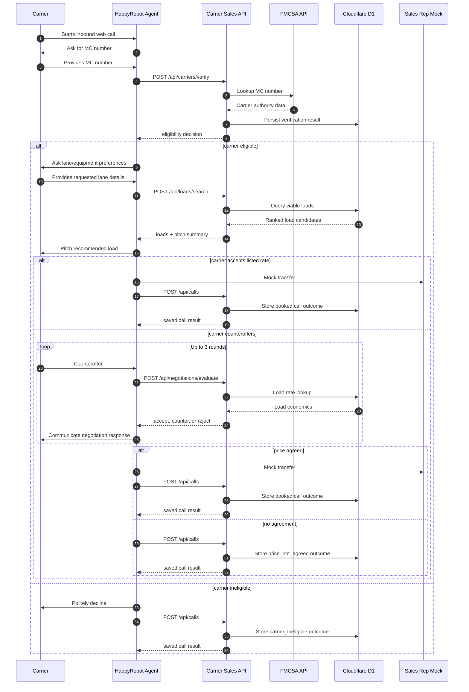
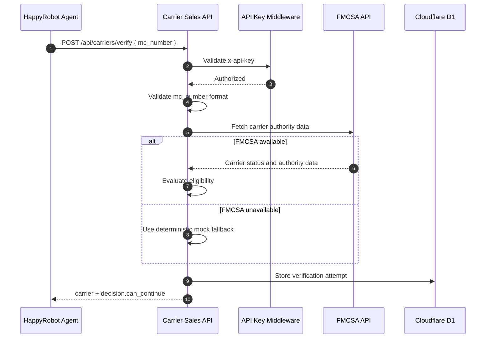
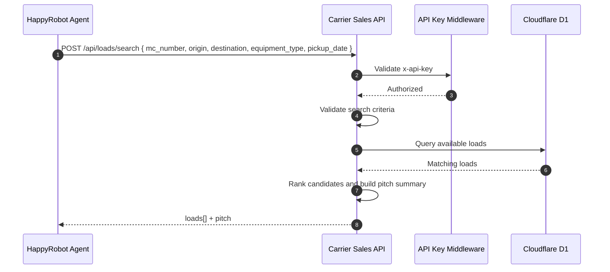
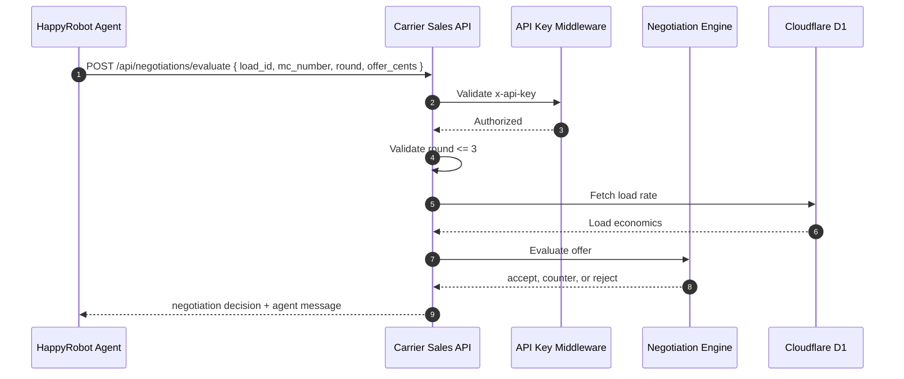
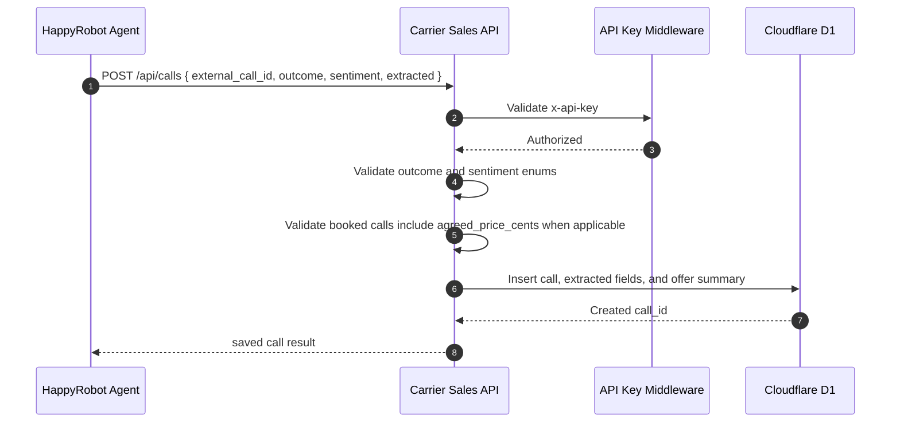
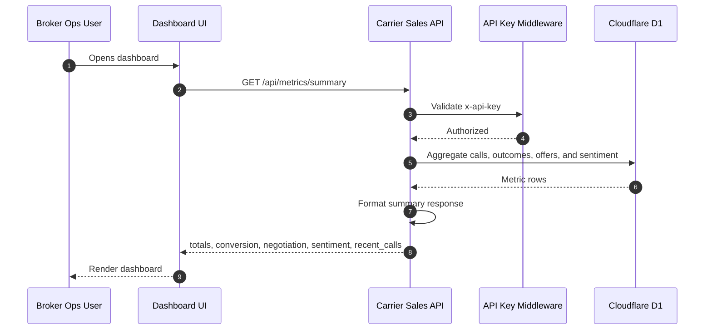

# API Sequence Diagrams

## Purpose

These diagrams describe how HappyRobot and the dashboard use the REST-oriented API during the inbound carrier sales workflow.

The API is intentionally small. Each endpoint maps to one workflow decision point and returns structured data that the agent can use directly.

## Full Call Flow

## `POST /api/carriers/verify`

### REST Contract Intent

- Resource focus: carrier verification.
- The endpoint is a controlled action because verification depends on an external authority lookup.
- The response returns both raw carrier summary and a workflow decision.

## `POST /api/loads/search`

### REST Contract Intent

- Resource focus: load collection search.
- `POST` is used instead of `GET` because the query can become structured and the voice workflow benefits from a stable JSON body.
- The response includes a generated `pitch.summary` so HappyRobot does not have to assemble load details manually.

## `POST /api/negotiations/evaluate`

### REST Contract Intent

- Resource focus: negotiation evaluation.
- The endpoint is deterministic for a given load, offer, and round.
- Persistence of the final outcome still happens through `POST /api/calls`; this endpoint only evaluates the current offer and does not store negotiation rounds.

## `POST /api/calls`

### REST Contract Intent

- Resource focus: call records.
- This is the source of truth for dashboard metrics.
- The API stores structured extraction, not full transcripts.

## `GET /api/metrics/summary`

### REST Contract Intent

- Resource focus: metrics summary.
- This is read-only.
- The MVP exposes only one dashboard endpoint to avoid premature analytics complexity.
