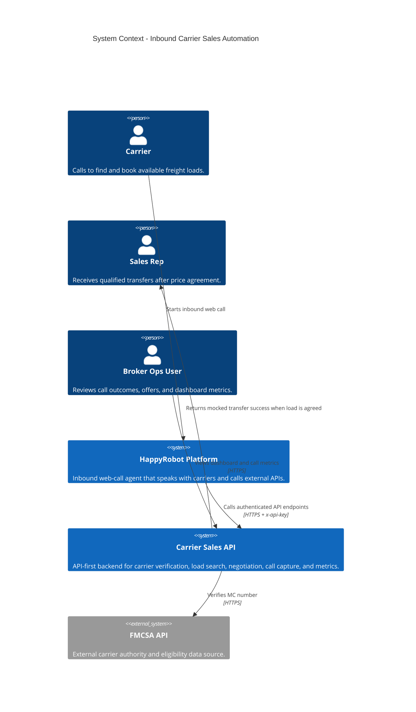
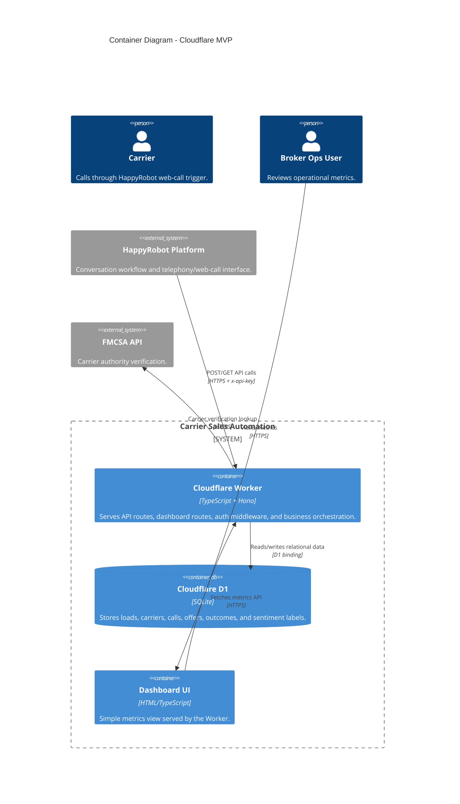
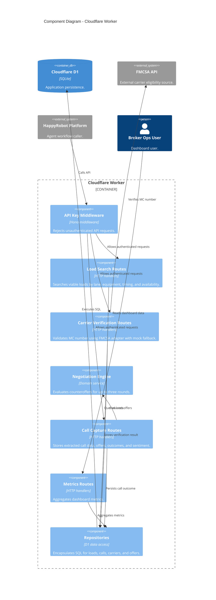
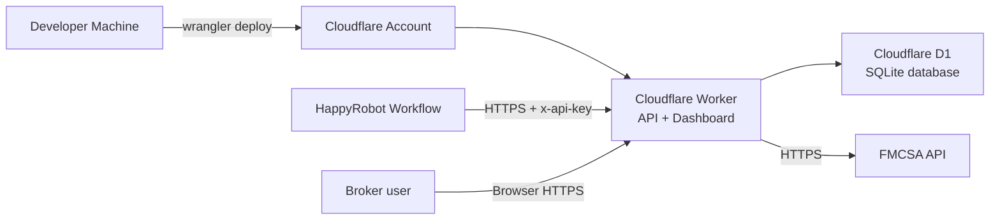

# C4 Architecture

## System Context

## Container Diagram

## Component Diagram

## Deployment View

## Notes

- The production deployment target is Cloudflare Workers + D1.
- Workers VPC is intentionally excluded because no private external service is required.
- Docker can be added as a local reproducibility artifact without changing the production architecture.
- API-first TDD keeps the HappyRobot integration contract stable while persistence evolves.
