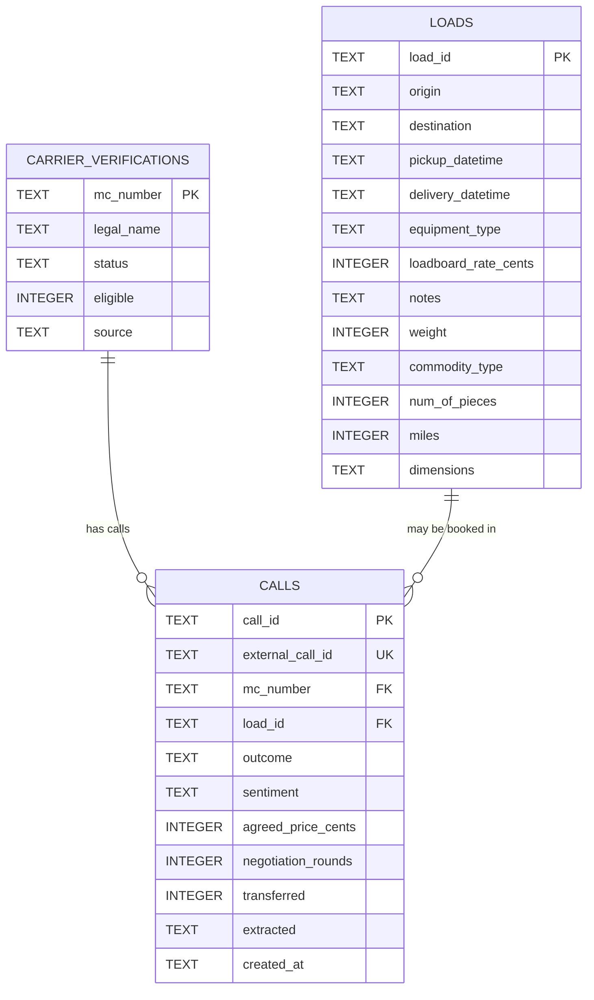

# Database ERD

## Purpose

This document explains the current D1/SQLite schema used by the Carrier Sales API MVP.

The schema is intentionally small and maps directly to the API contract:

- `loads`: freight loads that can be searched and pitched.
- `carrier_verifications`: normalized carrier eligibility records.
- `calls`: final structured call outcomes used for metrics.

## ERD



## Relationships

### `carrier_verifications` to `calls`

One carrier can have many calls.

```sql
FOREIGN KEY (mc_number) REFERENCES carrier_verifications(mc_number)
```

This lets us connect a saved call outcome to the carrier that participated in the call.

### `loads` to `calls`

One load can appear in many calls over time, although only one final booked result should matter for this MVP workflow.

```sql
FOREIGN KEY (load_id) REFERENCES loads(load_id)
```

`load_id` is nullable because some calls end before a load is selected, for example:

- `carrier_ineligible`
- `no_matching_load`
- `not_interested`
- `incomplete`

## Tables

### `loads`

Stores the searchable freight load inventory.

Important fields:

- `load_id`: stable load identifier.
- `origin`, `destination`: lane search inputs.
- `equipment_type`: required equipment filter.
- `pickup_datetime`: used for pickup date matching.
- `loadboard_rate_cents`: baseline for negotiation.
- `miles`, `weight`, `commodity_type`, `num_of_pieces`, `dimensions`: load pitch details.

### `carrier_verifications`

Stores normalized carrier verification results.

Important fields:

- `mc_number`: primary identifier from the carrier.
- `status`: normalized authority status.
- `eligible`: boolean stored as SQLite integer `0` or `1`.
- `source`: whether the verification came from `fmcsa` or deterministic `mock`.

This table intentionally does not model the raw FMCSA payload. The API only needs a workflow decision.

### `calls`

Stores the final structured result of each HappyRobot call.

Important fields:

- `external_call_id`: HappyRobot call identifier; unique for idempotency.
- `mc_number`: carrier involved in the call.
- `load_id`: selected load, nullable when no load was selected.
- `outcome`: business result of the call.
- `sentiment`: classified carrier sentiment.
- `agreed_price_cents`: final agreed price when booked.
- `negotiation_rounds`: summary count, not per-round persistence.
- `transferred`: whether the mock transfer happened.
- `extracted`: JSON string with flexible extracted details.
- `created_at`: used for recent activity and dashboard ordering.

## Indexes

Indexes are included only where they support the current API routes.

### `idx_loads_lane`

```sql
CREATE INDEX idx_loads_lane ON loads(origin, destination);
```

Supports `POST /api/loads/search`, where the primary search input is a lane.

Expected query shape:

```sql
WHERE origin = ?
  AND destination = ?
```

This is the most important load-search index because lane matching is core to pitching a viable load.

### `idx_loads_equipment_type`

```sql
CREATE INDEX idx_loads_equipment_type ON loads(equipment_type);
```

Supports equipment filtering for `POST /api/loads/search`.

Expected query shape:

```sql
WHERE equipment_type = ?
```

This index is useful when equipment type is selective. If the table stays very small, it is not critical, but it keeps the intended access pattern explicit.

### `idx_loads_pickup_datetime`

```sql
CREATE INDEX idx_loads_pickup_datetime ON loads(pickup_datetime);
```

Supports filtering and ordering by pickup time.

Expected query shapes:

```sql
WHERE pickup_datetime LIKE '2026-06-19%'
ORDER BY pickup_datetime ASC
```

The current implementation can filter by pickup date and orders matches by earliest pickup.

### `idx_carrier_verifications_eligible`

```sql
CREATE INDEX idx_carrier_verifications_eligible ON carrier_verifications(eligible);
```

Supports possible dashboard or admin queries that separate eligible from ineligible carriers.

This index is not required by the current HappyRobot call path because carrier verification reads by primary key `mc_number`. It is a low-cost index for likely reporting needs, but it can be removed if we want the schema to stay strictly route-driven.

### `idx_calls_mc_number`

```sql
CREATE INDEX idx_calls_mc_number ON calls(mc_number);
```

Supports looking up call history for a carrier.

Expected future query shape:

```sql
WHERE mc_number = ?
```

This is useful for debugging repeat callers or showing carrier-specific history.

### `idx_calls_load_id`

```sql
CREATE INDEX idx_calls_load_id ON calls(load_id);
```

Supports looking up call outcomes for a specific load.

Expected future query shape:

```sql
WHERE load_id = ?
```

This can help answer whether a load has already been discussed or booked.

### `idx_calls_created_at`

```sql
CREATE INDEX idx_calls_created_at ON calls(created_at DESC);
```

Supports `GET /api/metrics/summary`, specifically the `recent_calls` section.

Expected query shape:

```sql
ORDER BY created_at DESC
LIMIT ?
```

This is the most important index on `calls` for the current dashboard behavior.

## Index Review

Strictly required today:

- `idx_loads_lane`
- `idx_loads_pickup_datetime`
- `idx_calls_created_at`

Useful but more forward-looking:

- `idx_loads_equipment_type`
- `idx_carrier_verifications_eligible`
- `idx_calls_mc_number`
- `idx_calls_load_id`

If we want the database to be even more minimal, the forward-looking indexes can be removed until a route needs them.
